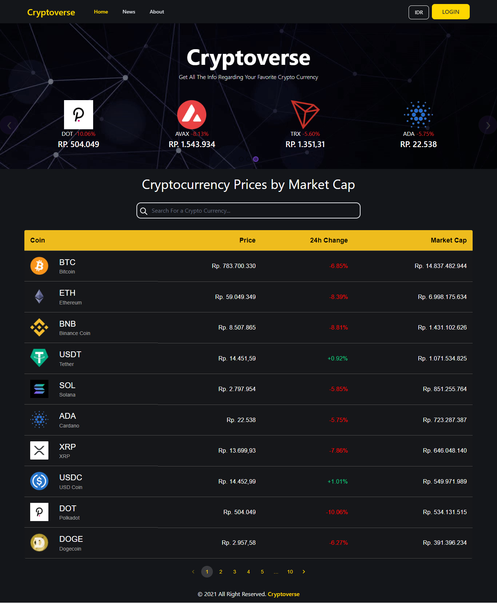
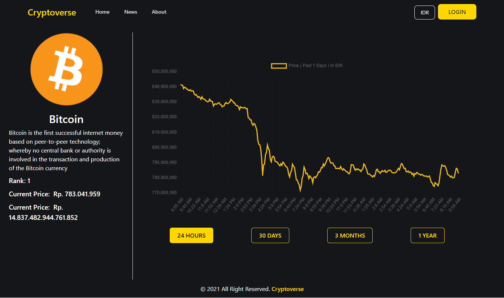
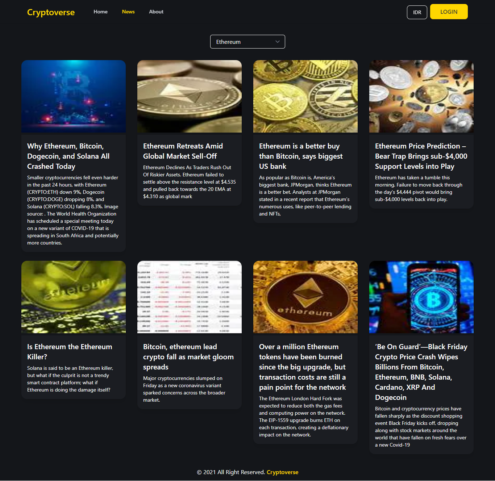

# Cryptoverse - Explore the World of Cryptocurrency

    
    
    

## Tentang Cryptoverse 
Cryptoverse adalah sebuah sistem informasi yang menyajikan data tentang cryptocurrency secara realtime, agar dapat membantu para pengguna cryptocurrency dalam melakukan kegiatannya.

## Cryptocurrency
Cryptocurrency adalah mata uang digital yang dijamin dengan kriptografi, yang membuatnya sulit untuk dipalsukan. Banyak cryptocurrency adalah jaringan terdesentralisasi berdasarkan teknologi blockchain (buku besar terdistribusi yang diberlakukan oleh jaringan komputer yang berbeda). ​